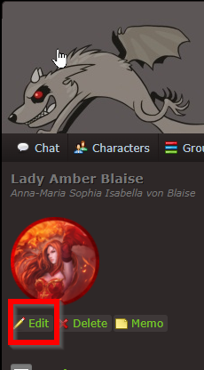
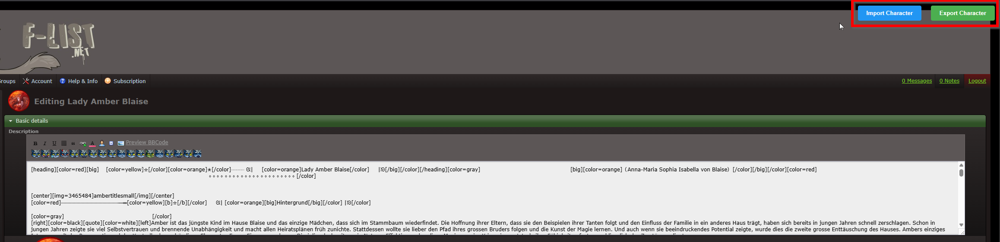
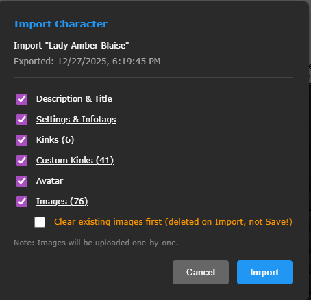
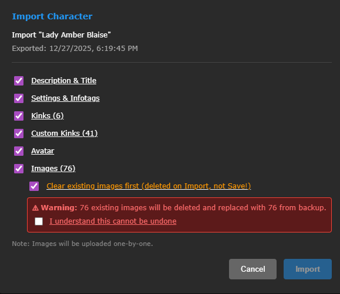
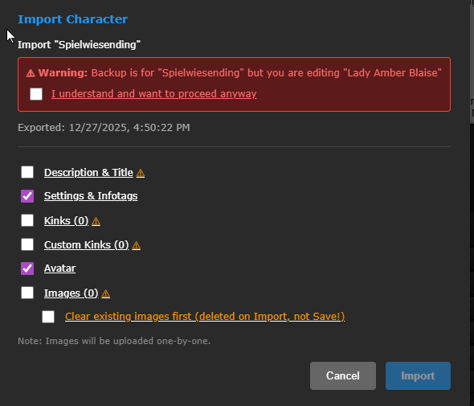

# F-list Character Exporter

A userscript to export and import F-list character profiles as ZIP files, including images.

## Features

- Export character profiles with all data (description, settings, kinks, custom kinks)
- Include character images and inline images in exports (inlines must be restored manually)
- Import backups to restore or copy characters
- Selective import - choose which parts to restore
- Safety warnings for destructive operations

## Installation

1. Install [Violentmonkey](https://violentmonkey.github.io/) or [Tampermonkey](https://www.tampermonkey.net/)
2. [Click here to install the script](https://github.com/FoundryBlaise/FlistCharExporter/raw/main/flist-character-exporter.user.js)
3. Confirm the installation when prompted

## Usage

### Exporting a Character

1. Go to your character's page and click **Edit**

   

2. On the edit page, click **Export Character** in the top-right corner

   

3. Choose what to include in your export and click **Export ZIP**

   

### Importing a Character

1. On any character edit page, click **Import Character**
2. Select your previously exported ZIP file
3. Choose which parts to import

   

4. If replacing images, you'll need to confirm the destructive action. **F-List instantly deletes images when you remove them in the editor!**

   

5. The script warns you if the backup is for a different character

   

## Exported Data

The ZIP export includes:
- **character.json** - All character data:
  - Description (BBCode)
  - Custom title
  - Settings (public, timezone, badges, etc.)
  - Infotags (profile fields)
  - Kinks (all fetish preferences)
  - Custom kinks
- **avatar.png** - Character avatar
- **images/** - All character images (optional)
- **inlines/** - Inline images from description (export only, cannot be restored)

## Notes

- Images are uploaded one-by-one during import (this takes time)
- Inline images cannot be restored - they're for backup reference only
- Always click **Save** after importing to save your changes
- The script only runs on `f-list.net/character_edit.php` pages

## License

MIT